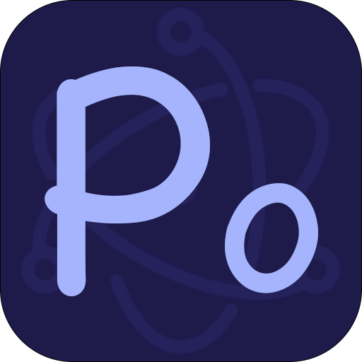

# Poros
[](http://umijs.org/) <a href="https://porosjs.com"></a>
[](https://github.com/umijs/dumi)



基于 Umi 的 Electron React 框架

> 您可以快速构建一个 Electron 项目，可以开发、打包、升级等，它具备 Umi 的所有功能。它还集成了常用的 electron 库，比如：electron-log、electron-store... 未来还将集成更多功能。

## 快速上手

### 创建项目

先找个地方建个空目录。

```bash
$ mkdir myapp && cd myapp
```

```bash
# pnpm 推荐
$ pnpm create poros

# npm
$ npx create-poros@latest

# yarn
$ yarn create poros
```

### 启动项目

执行 `pnpm start` 命令

> 第一次启动可能速度稍慢，请耐心等待...

```bash
        ╔═══════════════════════════════╗
ready - ║  Electron app launch success  ║
        ╚═══════════════════════════════╝
event - [Webpack] Compiled in 19830 ms (4955 modules)
info  - [MFSU][eager] write cache
info  - [MFSU] buildDepsAgain
info  - [MFSU] skip buildDeps
```

## 目录结构

```
├── config
│   ├── builder.ts                      // electron-builder 配置
│   ├── config.ts                       // umi 配置
│   └── routes.ts                       // umi routes 配置
├── mock                                
│   └── demo.ts
├── src
│   ├── constants
│   │   └── index.ts
│   ├── locales                         // 国际化目录,开启国际化插件有效
│   │   ├── en-US.ts
│   │   └── zh-CN.ts
│   ├── main                            // 主进程目录
│   │   ├── windows                     // 窗口目录
│   │   └── index.ts
│   ├── preload                         // preload 目录
│   │   └── index.ts
│   ├── renderer                        // 渲染进程目录，同umi
│   │   ├── assets
│   │   ├── models
│   │   ├── pages
│   │   ├── utils 
│   │   ├── ipc.ts                      // 渲染进程与主进程ipc通信定义文件，开启ipc插件有效
│   │   └── app.ts         
├── package.json
├── pnpm-lock.yaml
├── tsconfig.json
└── typings.d.ts
```

## 自定义窗口

框架约定以 `src/main/window` 目录作为自定定窗口目录

> 自定义窗口需要继承 `PorosBrowserWindow` 类, `PorosBrowserWindow` 为 `BrowserWindow` 子类

```typescript
// src/main/window/MainWindow
import path from 'path';
import { PorosBrowserWindow, PorosBrowserWindowOptions } from 'poros';

class MainWindow extends PorosBrowserWindow {
  /**
   * 是否单例, 默认：true
   */
  static readonly single = true;

  /**
   * 加载页面地址
   */
  protected static readonly URL = '/';

  /**
   * 窗口属性配置
   */
  protected static readonly OPTIONS: PorosBrowserWindowOptions = {
    title: 'Poros',
    height: 628,
    width: 542,
    minHeight: 628,
    minWidth: 542,
    hideOnClose: true,
    webPreferences: {
      preload: path.join(__dirname, 'preload/index.js'),
    },
  };

  constructor() {
    super(MainWindow.URL, MainWindow.OPTIONS);
  }

  protected registerWindowEvent(): void {}
}

export default MainWindow;
```

## 代理

支持打包后的跨域请求，配置同 `umi`，解决网络请求跨域问题，当然你也可以选择其他方式解决，比如：设置窗口属性 `webSecurity: false` (警告：不建议使用)

```ts
// config/config.ts
export default defineConfig({
  proxy: {
    '/api': {
      target: 'https://randomuser.me',
      changeOrigin: true,
    },
  },
}
```
打包后，可以通过 `app://./api/...` 访问到 `https://randomuser.me/api/...`

## API

> import { something } from 'poros';

### Main Process

| 参数 | 类型 | 说明 |
|-----|-----|-----|
| initialize | () => void | 初始化方法，需要在app ready之前调用 |
| PorosBrowserWindow | [PorosBrowserWindow](#PorosBrowserWindow) | 窗口基类 |
| PorosWindowManager | [PorosWindowManager](#PorosWindowManager) | 窗口管理类 |
| port | number | dev web服务端口 |
| logger | [Logger](#Logger) | 日志模块 |
| localStore | [LocalStore](#LocalStore) | 本地化存储，可以本地文件的方式存储一些配置信息 |
| localShortcut | [LocalShortcut](#LocalShortcut) | 窗口化快捷键 |
| isMacOS | boolean | 是否为macOS系统 |
| isWindows | boolean | 是否为Windows系统 |
| isLinux | boolean | 是否为Linux系统 |
| isX86 | boolean | 是否为x86架构 |
| isX64 | boolean | 是否为x64架构 |
| isDev | boolean | 是否为开发环境 |
| isProd | boolean | 是否为生产环境 |

### Renderer Process

> 透传 `umi` 的所有属性, 也加入了一些写的属性

| 参数 | 类型 | 说明 |
|-----|-----|-----|
| logger | [Logger](#Logger) | 日志模块 |
| localStore | [LocalStore](#LocalStore) | 本地化存储，可以本地文件的方式存储一些配置信息 |

### PorosBrowserWindow

继承至 `BrowserWindow`

| 参数 | 类型 | 说明 |
|-----|-----|-----|
| single | static readonly boolean | 是否单例, 默认：true |
| URL | static readonly string | 加载页面地址 |
| OPTIONS | static readonly PorosBrowserWindowOptions | 窗口配置项 |
| registerWindowEvent | () => void | 注册窗口事件 |

### PorosWindowManager

管理 `PorosBrowserWindow` 窗口

| 参数 | 类型 | 说明 |
|-----|-----|-----|
| create | (constructor: Type\<PorosBrowserWindow\>, ...properties: ConstructorParameters\<typeof constructor\>) => PorosBrowserWindow | 创建窗口实例 |
| destroy | `(id: number) => void` \| `(constructor: Type\<PorosBrowserWindow\>) => void` | 销毁窗口实例 |
| destroyAll | (excludes: Type\<PorosBrowserWindow\>[] = []) | 销毁所有窗口实例，excludes:排除项 |
| getAll | () => PorosBrowserWindow[] | 获取所有窗口 |
| get | `(constructor: PorosBrowserWindow) => PorosBrowserWindow\|Record<number, PorosBrowserWindow>\|undefined` \| `(id: number) => PorosBrowserWindow\|undefined`  | 获取窗口 |

### Logger

配置项 `config/config.ts`

```typescript
export default defineConfig({
   logger : {
     transports: {
       file: {
         level: 'warn',
         format: '[{y}-{m}-{d} {h}:{i}:{s}.{ms}] [{level}]{scope} {text}',
         maxSize: 1048576,
       },
       console: {
         level: 'debug',
       },
     },
   }
});
```

具体配置和用法可参照[electron-log](https://github.com/megahertz/electron-log)。

> 注意：控制台的日志输出为了作出类型区分加了特有的标志，所有 `transports.console.format` 的设置不会生效, 

### LocalStore

保存用户设置、应用程序状态、缓存等

配置项 `config/config.ts`

```typescript
export default defineConfig({
   localStore: {
     schema: {
       unicorn: {
          type: 'string',
         default: '🦄',
       },
     },
   },
});
```

具体配置和用法可参照[electron-store](https://github.com/sindresorhus/electron-store)。

### LocalShortcut

将键盘快捷键本地添加到 BrowserWindow 实例，而不使用菜单

`PorosBrowserWindow` 中内置了打开DevTools快捷键 `Cmd+Option+I` 或 `F12`

具体用法可参照[electron-localshortcut](https://github.com/parro-it/electron-localshortcut)。


## 插件

> 您也可以直接使用 Umi 插件。如果您遇到任何问题，请联系我。

### locale

与umi locale插件功能基本相同，开启方法一致，主进程与渲染进程中使用方法相同。

```typescript
import { localeInfo, getIntl, setIntl, getLocale, setLocale, getAllLocales, i18n } from 'poros';

i18n('button.ok');
```

| 参数 | 类型 | 说明 |
|-----|-----|-----|
| localeInfo | \{[key: string]: \{messages:{[key: string]},locale:string\}\} | 语言信息 |
| getIntl | (lang?: string, changeIntl?: boolean) => IntlShape | 日获取当前的 intl 对象志模块 |
| setIntl | (lang: string) => void | 切换全局的 intl 的设置 |
| getLocale | () => string | 获取当前选择的语言 |
| setLocale | (lang: string) => void | 设置语言 |
| getAllLocales | string[] | 获取多语言列表 |
| i18n | (id:string, values?: Record<string, any>) => string | formatMessage语法糖 |

### ipc

简化主进程与渲染进程之间的通信

#### 主进程API

| 参数 | 类型 | 说明 |
|-----|-----|-----|
| IpcHandle | - | ipc方法注解，`PorosBrowserWindow`内使用 |
| rendererInvoker | {[method: string]: (...args:any[], opts?: { broadcast?: boolean, window?: PorosBrowserWindow})} | 渲染进程方法调用器 |

`rendererInvoker` 中 `broadcast` 为 `true` 时，会给所有窗口广播事件(广播事件无返回值)，所有监听了事件的窗口都会收到消息，反之只有相应的窗口下页面会收到消息。`PorosBrowserWindow` 类中调用，window默认值为当前窗口，非`PorosBrowserWindow` 类中必需指定window值。

#### 渲染进程API

| 参数 | 类型 | 说明 |
|-----|-----|-----|
| useIpc | (channel: string ,callback?:(...args:any[])=>any)=>any[] | ipc方法注解，`PorosBrowserWindow`内使用 |
| mainInvoker | {[windowName: string]: {[method: string]: (...args:any)=>any}, open: ()=>void} | 主进程方法调用器 |

#### 渲染进程调用主进程

```typescript
// 1、使用IpcHandle注解要调用的方法
import { IpcHandle } from 'poros';
class MainWindow extends PorosBrowserWindow {
  // ... 省略基本属性

  @IpcHandle
  foo(name: string) {
    return 'Hello renderer'; // 返回给渲染进程
  }
}

export default MainWindow;

// 2、渲染进程中调用
import { mainInvoker } from 'poros';
const ret = mainInvoker.MainWindow.foo('demo');
```

#### 主进程调用渲染进程

1、定义事件类型(/src/renderer/ipc.ts)
```typescript
export default interface IpcChannelToHandlerMap {
  'network-monitor': (received: number, transferred: number) => string;
}
```

2、react组件中监听
```tsx
import { mainInvoker } from 'poros';

const Demo = () => {
  useIpc('network-monitor', (received, transferred) => {
    return ''; // 返回值给主进程
  });
  // 或者
  const [received, transferred] = useIpc('network-monitor');

  return (
    <div>demo</div>
  );
};
export default Demo;
```

3、主进程中调用
```typescript
// PorosBrowserWindow类中调用
const ret = this.rendererInvoker.networkMonitor(received: number, transferred: number, opts?: { broadcast?: boolean, window?: PorosBrowserWindow}); 

// 非PorosBrowserWindow类中调用
import { rendererInvoker } from 'poros';
rendererInvoker.networkMonitor(received: number, transferred: number, opts: { broadcast?: boolean, window: PorosBrowserWindow });
```

## 预设插件
- initial-state
- access
- model
- react-query
- antd
- request
- locale
- ipc


## 引用与参考
- [umi](https://github.com/umijs/umi)
- [umi-plugin-electron-builder](https://github.com/BySlin/umi-plugin-electron-builder)
- [electron-log](https://github.com/megahertz/electron-log)      
- [electron-store](https://github.com/sindresorhus/electron-store)
- [electron-localshortcut](https://github.com/parro-it/electron-localshortcut)                     


## 许可

[MIT](https://github.com/porosjs/poros/blob/main/LICENSE)
